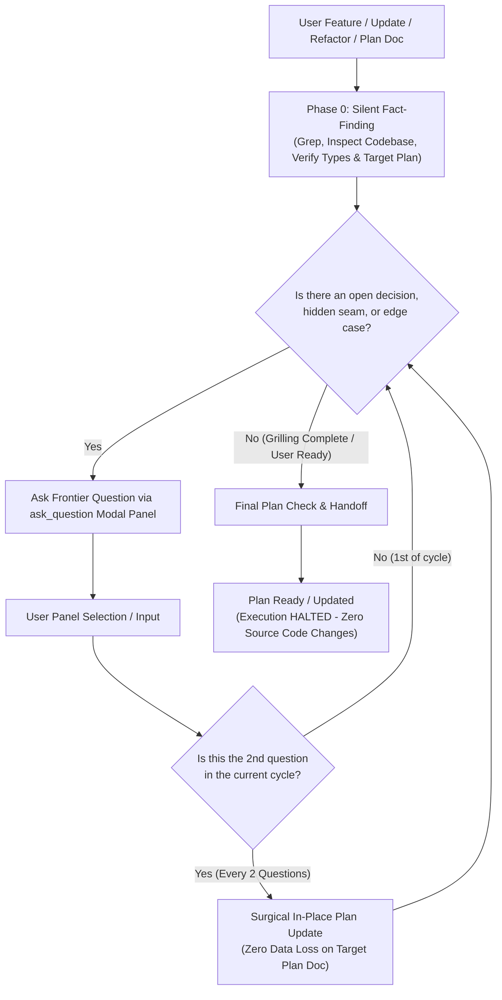

<!--
================================================================================
SKILL SYNTHESIS & DERIVATION METADATA
================================================================================
This skill (`clarify-first-delizade`) is a unified synthesis and architectural evolution
of two foundational skills:

1. `grilling` (Antigravity Core / Gemini):
   - Autonomous Fact-Finding: AI autonomously inspects the codebase/environment rather than burdening the user with factual questions.
   - Relentless Continuous Interview: Interrogates assumptions, uncovers hidden seams, and explores edge cases without prematurely cutting the interview short.
   - Dynamic Decision Tree (Frontier): Models architectural problems as a dependency graph where resolved decisions unlock downstream branches and prune irrelevant ones.
   - Anti-Assumption Rigor: Prevents proceeding on silent assumptions.

2. `ask-then-build` (by David Ondrej):
   - Interactive Modal / Panel UI: Questions are presented directly in the IDE's interactive modal panel (`ask_question` tool) rather than raw chat text, featuring selectable options and an explicit `(Recommended)` first option.
   - Sequential Low-Cognitive-Load Interaction: Questions are asked strictly ONE AT A TIME.
   - 2-Question Incremental Plan Sync: Automatically persists decisions to the plan document every 2 questions, preventing context loss and maintaining an evolving specification.
   - Plan Synthesis & In-Place Refinement: Weaves settled decisions directly into an existing plan document with zero data loss (or compiles an execution-ready plan).

3. `domain-modeling`:
   - Ubiquitous Language & Canonical Glossary: Actively challenge and align terminology against `CONTEXT.md`. Proactively sharpen fuzzy or overloaded domain language during grilling.
   - Inline Ontology & ADR Crystallization: When domain boundaries, entities, or irreversible trade-offs crystallize during grilling, synchronize them with `CONTEXT.md` and `docs/adr/`.

4. Delizade Directive (Strict Plan-Only & Zero-Loss In-Place Update Invariant):
   - Scope is strictly limited to clarification, decision resolution, domain alignment, and implementation planning.
   - The agent MUST NOT touch application source code (`src/`), database migrations, or build commands.
   - If an existing plan document is referenced or active, the agent updates that document directly in-place every 2 questions with absolute preservation of established rules, invariants, and notes. It stops immediately upon delivering or finalizing the plan.
================================================================================
-->

Turn feature ideas, component/system updates, architectural decisions, or refactoring requests into execution-ready build specifications through autonomous codebase exploration, sequential interactive modal panels, continuous deep grilling, 2-question incremental in-place plan synchronization, and zero-loss plan refinement.

---

## Workflow Overview

---

## Phase 0 — Silent Fact-Finding (Fact vs. Decision Boundary)

1. **Facts belong to the AI, never the user.** Before asking anything, autonomously inspect the repository using available search and read tools:
   - Identify affected files, call sites, exports, interfaces, domain services, database schemas, and existing UI components.
   - Audit `CONTEXT.md` (or domain glossary) and existing ADRs (`docs/adr/` or `Architecture_Decision.md`) to establish domain vocabulary, ubiquitous language, and active architectural invariants.
   - Trace existing behaviors, edge cases, regression risks, architectural rules, and design system tokens.
   - Detect if an existing plan document is active or referenced (e.g., `docs/plan-*.md`, `implementation_plan.md`, or a file currently open/mentioned in context).
2. **Never ask the user for facts you can look up yourself.** If a file path, function signature, current implementation, or configuration can be grepped, find it silently.
3. Formulate questions **only** for genuine business, architectural, UI/UX, or behavioral decisions where multiple valid tradeoffs or update strategies exist.

---

## Phase 1 — Continuous Interactive Grilling Loop (`ask_question` Modal Tool)

1. **Continuous Multi-Round Interview (Anti-Premature Exit)**:
   - **Never stop after just 1 or 2 questions.** Grilling is an exhaustive, rigorous process to interrogate assumptions, resolve trade-offs, and harden the architecture before code is written.
   - Do NOT rush to complete. Systematically traverse all key architectural dimensions across the frontier:
     1. **Domain Ontology & Ubiquitous Language (`/domain-modeling`)**:
        - Challenge against the glossary: If the user or spec uses terms conflicting with `CONTEXT.md`, call it out immediately.
        - Sharpen fuzzy language: Eliminate vague or overloaded terms; propose canonical domain entities.
        - Probe boundaries with concrete scenarios: Stress-test entity lifecycles, SSOT, disk vs DB, and persistence guarantees.
        - Offer ADRs sparingly: Propose an ADR only when hard to reverse, surprising without context, and the result of a real trade-off.
     2. **State Lifecycles & Invariants**: State transitions (`Draft -> Provisional -> Canon`), rollbacks, failure recovery.
     3. **Cognitive Contracts & AI Gating**: Zod schemas, prompt compiling, fail-fast zero-fabrication boundaries.
     4. **Resource Constraints & Concurrency**: GPU/VRAM locks, task queues, rate limits, caching, timeouts.
     5. **User Experience & Interaction Boundaries**: Progressive disclosure, manual overrides vs AI suggestions, diff views.
     6. **Edge Cases & Failure Modes**: Network drops, partial disk writes, model timeouts, contradictory user inputs.

2. **Sequential One-at-a-Time Execution**:
   - Ask strictly **ONE question at a time**. Never bundle multiple questions together.
   - Present every question through the `ask_question` modal panel tool.

3. **Mandatory Interactive Modal / Panel Invariant (CRITICAL)**:
   <formatting_directive priority="critical">
   - **NEVER output questions as raw markdown text in the chat conversation.** The user must see the question, choices, and recommendation rendered inside the IDE's interactive UI panel/modal dialog.
   - ALWAYS invoke the `ask_question` tool to present questions.
   </formatting_directive>

4. **`ask_question` Modal Tool Usage Rules**:
   - **Question Title & Context**: State the core question and concise architectural/tradeoff context. When specifying files, format them as clickable links (e.g. `[filename](file:///path/to/file)`).
   - **List Recommended Option First**: The AI's recommended choice MUST be listed as the very first option and prefixed with `(Recommended)` (e.g., `(Recommended) Decouple via event bus and keep state immutable`).
   - **Direct User Perspective**: Format option labels as the user's direct response/action (e.g., `"Use standard SQLite transaction"` rather than `"I will use SQLite transaction"`).
   - **No Manual Letters or 'Other'**: Do NOT prefix options with letters ("A.", "B.") and do NOT add an "Other" option (the IDE modal automatically numbers options and provides a default write-in input).
   - **IsMultiSelect**: Set to `false` for single-choice architectural forks; set to `true` only when independent multiple options can be chosen together.

5. Execution is blocked in the IDE until the user clicks an option and presses Submit in the modal panel.

6. **⚡ Incremental In-Place Document Sync Cadence (Every 2 Questions)**:
   <sync_directive cadence="every_2_questions" priority="critical">
   - **Her 2 Soruda Bir Güncelleme (2-Question Cadence)**: Her 2 soru ve cevap tamamlandığında (1. ve 2. soru, ardından 3. ve 4. soru vb.), hedef plan dökümanını (`docs/plan-*.md` veya `implementation_plan.md`) o ana kadar kesinleşen kararlara göre doğrudan disk üzerinde cerrahi olarak güncelle (`replace_file_content` veya `write_to_file`).
   - **Domain Sözlüğü & ADR Senkronizasyonu**: Grilling sırasında yeni bir kanonik domain kavramı netleşmişse `CONTEXT.md` sözlüğünü, geri dönüşü zor bir mimari karar kesinleşmişse ilgili ADR dökümanını plana paralel olarak doğrudan disk üzerinde güncelle.
   - **Zero-Loss Prensibi (Sıfır Veri Kaybı)**: Güncelleme sırasında dökümandaki mevcut kurallar, mimari değişmezler, kabul kriterleri ve notlar %100 korunur. Asla özetleme, silme veya kısaltma yapılmaz; sadece yeni kararlar dökümanın ilgili bölümlerine cerrahi olarak eklenir veya güncellenir.
   - **Grilling'e Derhal Geri Dönüş (Resume Grilling Immediately)**: Döküman güncellendikten sonra sohbette uzun metinler basarak duraklama; hemen sıradaki soruyu (`ask_question` modal paneli) açarak grilling döngüsünü kesintisiz devam ettir.
   </sync_directive>

7. **Loop Continuation & Finalization**:
   - Grilling döngüsü tüm mimari boyutlar ve kısıtlar taranana kadar devam eder.
   - Döngü YALNIZCA şu iki durumda tamamlanır:
     1. Tüm kritik mimari boyutlar, dikişler ve uç durumlar eksiksiz sorgulanıp plana işlendiğinde, VEYA
     2. Kullanıcı planı sonlandırmak istediğini açıkça belirttiğinde (seçenek veya write-in ile).

---

## Phase 2 — Plan Synthesis & In-Place Refinement

Grilling döngüsü tamamlandığında dökümanın son hali doğrulanır:

### Mode A: In-Place Plan Update (Hedef Plan Dökümanı Varsa)
Kullanıcı bir plan dökümanı sağlamışsa veya aktif olarak bir plan dosyası üzerinde çalışılıyorsa (örneğin `docs/plan-*.md`, `implementation_plan.md`):
1. **Direct In-Place Modification**: Hedef döküman disk üzerinde cerrahi araçlarla güncellenmiş durumdadır.
2. **Zero-Loss Plan Preservation Protocol (CRITICAL)**:
   - **Absolute Retention of Established Knowledge**: Dökümanda daha önce oluşturulmuş hiçbir kural, mimari invariant, formül, yaratıcı bağlam veya kabul testi silinmez veya özetlenerek küçültülmez.
   - **Strict Surgicality**: Değişiklikler yalnızca yeni kararların etkilediği bloklara cerrahi olarak uygulanır.
3. **No Chat Bloat**: Tüm plan metnini sohbete yapıştırma. Yalnızca yapılan güncellemeleri özetleyen 3-4 maddelik kısa bir bildirim ver ve dökümana link ver.

### Mode B: Greenfield Plan Delivery (Henüz Plan Dökümanı Yoksa)
Eğer ortada bir plan dosyası yoksa, yeni bir **Implementation Plan** derle:
1. **Authoritative Context & Read-First Files**: Hedef dosyalar, şemalar ve kurallar (`AGENTS.md`, tasarım token'ları, servis kontratları).
2. **Concrete Implementation Steps**: Numaralandırılmış dosya bazlı net adımlar.
3. **Validation & Verification**: Otomasyon testleri, tip kontrol komutları veya manuel doğrulama kriterleri.
4. **Execution Boundaries**: Kapsam sınırları.

---

## 🛑 CRITICAL INVARIANTS: SOURCE CODE LOCK & ZERO DATA LOSS

Bu skil kesinlikle bir **netleştirme ve planlama** skilidir.
1. **Kaynak Kodlar Kilitlidir**: Ajan KESİNLİKLE uygulama kaynak kodlarını (`src/`) değiştiremez, veritabanı migrasyonu çalıştıramaz, paket kuramaz veya derleme komutu veremez.
2. **İzin Verilen Dosya Değişiklikleri**: Yalnızca üzerinde anlaşılan plan dökümanı (örneğin `docs/plan-*.md`, `implementation_plan.md`) ile netleşen domain model dökümanları (`CONTEXT.md`, `docs/adr/*.md`) güncellenebilir. Uygulama kaynak kodları (`src/`) kesinlikle kilitlidir.
3. **Sıfır Veri Kaybı (Zero-Loss)**: Plan güncellenirken mevcut bağlam, formüller veya kurallar asla budanamaz.
4. **Açık El Sıkışma (Explicit Handoff)**: Plan tamamlandıktan sonra kullanıcıya açıkça bildir:
   > *"Plan dökümanı başarıyla güncellendi ve tüm kararlar dökümana işlendi. Planı inceleyip onayladığınızda veya başlamak istediğinizde uygulamaya geçebiliriz."*
5. **HALT EXECUTION IMMEDIATELY**: Kod uygulamasına KESİNLİKLE başlama. Kullanıcının açık onayını bekle.
