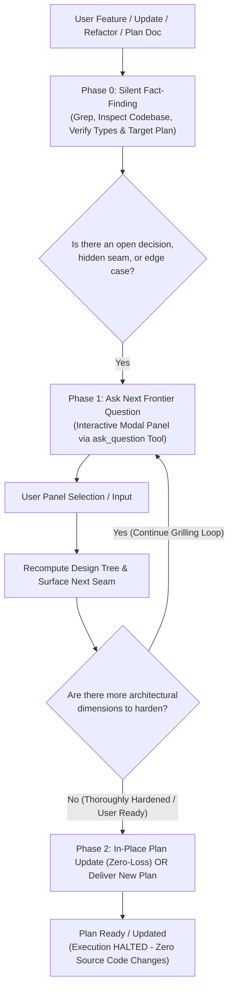

<!--
================================================================================
SKILL SYNTHESIS & DERIVATION METADATA
================================================================================
This skill (`clarify-first-delizade`) is a unified synthesis and architectural evolution
of two foundational skills:

1. `grilling` (Antigravity Core / Gemini):
   - Autonomous Fact-Finding: AI autonomously inspects the codebase/environment rather than burdening the user with factual questions.
   - Relentless Continuous Interview: Interrogates assumptions, uncovers hidden seams, and explores edge cases without prematurely cutting the interview short.
   - Dynamic Decision Tree (Frontier): Models architectural problems as a dependency graph where resolved decisions unlock downstream branches and prune irrelevant ones.
   - Anti-Assumption Rigor: Prevents proceeding on silent assumptions.

2. `ask-then-build` (by David Ondrej):
   - Interactive Modal / Panel UI: Questions are presented directly in the IDE's interactive modal panel (`ask_question` tool) rather than raw chat text, featuring selectable options and an explicit `(Recommended)` first option.
   - Sequential Low-Cognitive-Load Interaction: Questions are asked strictly ONE AT A TIME.
   - Plan Synthesis & In-Place Refinement: Compiles settled decisions into an execution-ready plan or weaves them directly into an existing plan document with zero data loss.

3. Delizade Directive (Strict Plan-Only & Zero-Loss In-Place Update Invariant):
   - Scope is strictly limited to clarification, decision resolution, and implementation planning.
   - The agent MUST NOT touch application source code (`src/`), database migrations, or build commands.
   - If an existing plan document is referenced or active, the agent updates that document directly in-place with absolute preservation of established rules, invariants, and notes. It stops immediately upon delivering or updating the plan.
================================================================================
-->

Turn feature ideas, component/system updates, architectural decisions, or refactoring requests into execution-ready build specifications through autonomous codebase exploration, sequential interactive modal panels, continuous deep grilling, and zero-loss in-place plan refinement or concise plan compilation.

---

## Workflow Overview

---

## Phase 0 — Silent Fact-Finding (Fact vs. Decision Boundary)

1. **Facts belong to the AI, never the user.** Before asking anything, autonomously inspect the repository using available search and read tools:
   - Identify affected files, call sites, exports, interfaces, domain services, database schemas, and existing UI components.
   - Trace existing behaviors, edge cases, regression risks, architectural rules, and design system tokens.
   - Detect if an existing plan document is active or referenced (e.g., `docs/plan-*.md`, `implementation_plan.md`, or a file mentioned in context).
2. **Never ask the user for facts you can look up yourself.** If a file path, function signature, current implementation, or configuration can be grepped, find it silently.
3. Formulate questions **only** for genuine business, architectural, UI/UX, or behavioral decisions where multiple valid tradeoffs or update strategies exist.

---

## Phase 1 — Continuous Interactive Grilling Loop (`ask_question` Modal Tool)

1. **Continuous Multi-Round Interview (CRITICAL — Anti-Premature Exit)**:
   - **Never stop after just 1 or 2 questions.** Grilling is an exhaustive, rigorous process to interrogate assumptions, resolve trade-offs, and harden the architecture before code is written.
   - Do NOT rush to Phase 2. Systematically traverse all key architectural dimensions across the frontier:
     1. **Domain Ontology & Storage Seams**: SSOT, disk files vs SQLite, manifests, persistence guarantees.
     2. **State Lifecycles & Invariants**: State transitions (`Draft -> Provisional -> Canon`), rollbacks, failure recovery.
     3. **Cognitive Contracts & AI Gating**: Zod schemas, prompt compiling, fail-fast zero-fabrication boundaries.
     4. **Resource Constraints & Concurrency**: GPU/VRAM locks, task queues, rate limits, caching, timeouts.
     5. **User Experience & Interaction Boundaries**: Progressive disclosure, manual overrides vs AI suggestions, diff views.
     6. **Edge Cases & Failure Modes**: Network drops, partial disk writes, model timeouts, contradictory user inputs.

2. **Sequential One-at-a-Time Execution**:
   - Ask strictly **ONE question at a time**. Never bundle multiple questions together.
   - After each answer, update the internal decision model, identify the next most pivotal seam, and ask the next question immediately.

3. **Mandatory Interactive Modal / Panel Invariant (CRITICAL)**:
   <formatting_directive priority="critical">
   - **NEVER output questions as raw markdown text in the chat conversation.** The user must see the question, choices, and recommendation rendered inside the IDE's interactive UI panel/modal dialog.
   - ALWAYS invoke the `ask_question` tool to present questions.
   </formatting_directive>

4. **`ask_question` Modal Tool Usage Rules**:
   - **Question Title & Context**: State the core question and concise architectural/tradeoff context. When specifying files, format them as clickable links (e.g. `[filename](file:///path/to/file)`).
   - **List Recommended Option First**: The AI's recommended choice MUST be listed as the very first option and prefixed with `(Recommended)` (e.g., `(Recommended) Decouple via event bus and keep state immutable`).
   - **Direct User Perspective**: Format option labels as the user's direct response/action (e.g., `"Use standard SQLite transaction"` rather than `"I will use SQLite transaction"`).
   - **No Manual Letters or 'Other'**: Do NOT prefix options with letters ("A.", "B.") and do NOT add an "Other" option (the IDE modal automatically numbers options and provides a default write-in input).
   - **IsMultiSelect**: Set to `false` for single-choice architectural forks; set to `true` only when independent multiple options can be chosen together.

5. Execution is blocked in the IDE until the user clicks an option and presses Submit in the modal panel.

6. **Loop Continuation & Finalization**:
   - Continue the loop across all open dimensions.
   - Transition to Phase 2 ONLY when:
     1. All critical architectural dimensions, seams, and edge cases have been exhaustively probed and resolved, OR
     2. The user explicitly requests to finalize the plan (e.g. via write-in or option).

---

## Phase 2 — Plan Synthesis & In-Place Refinement

Once the grilling loop is completed and all dimensions are settled, the agent delivers the plan:

### Mode A: In-Place Plan Update (When an Existing Plan Document Exists)
If the user provides a plan document, references one in the prompt, or is actively working on a plan file (e.g. `docs/plan-*.md`, `implementation_plan.md`):
1. **Direct In-Place Modification**: Update the target plan document directly on disk using surgical file editing tools (`replace_file_content` or `write_to_file`).
2. **Zero-Loss Plan Preservation Protocol (CRITICAL)**:
   - **Absolute Retention of Established Knowledge**: Never summarize away, compress, or silently delete existing architectural invariants, domain rules, mathematical formulas, notes, creative context, or acceptance criteria already established in the document.
   - **Strict Surgicality**: Content modification or removal is permitted ONLY for the exact lines, fields, or blocks directly and intentionally superseded by the newly settled decisions. All unaffected sections must remain 100% intact.
   - **Structural Migration Safety**: If detailing, splitting, or reorganizing zones, dependency hierarchies, or file topologies, every existing rule and note from the previous structure must be carefully carried over into the updated layout. Zero data loss.
3. **No Chat Bloat**: Do NOT dump the entire plan text into the chat conversation. Provide a concise, bulleted changelog highlighting what was updated in the plan file, and link to the updated document.

### Mode B: Greenfield Plan Delivery (When No Plan Document Exists)
If no existing plan document is referenced, compile a single, dense, execution-ready **Implementation Plan**:
1. **Authoritative Context & Read-First Files**: Target files, schemas, and governing rules (`AGENTS.md`, design tokens, service contracts).
2. **Concrete Implementation Steps**: Numbered, file-level changes detailing exact modifications without speculative fluff.
3. **Validation & Verification**: Automated tests, typecheck commands, lint checks, or manual visual validation criteria.
4. **Execution Boundaries**: Strict scope boundaries (e.g., zero regression on existing interfaces, adhere to design system, no unused dependencies).

---

## 🛑 CRITICAL INVARIANTS: SOURCE CODE LOCK & ZERO DATA LOSS

This skill is strictly a **clarification and planning** skill.
1. **Source Code is Locked**: Under NO circumstances should the agent modify application source code (`src/`), run database migrations, install packages, or execute build commands.
2. **Permitted File Modifications**: The ONLY allowed file write/edit operations are on the designated plan or architecture documentation files (e.g., `docs/plan-*.md`, `implementation_plan.md`).
3. **Zero-Loss Plan Integrity**: When updating an existing plan, never truncate, drop, or summarize established context. Edits must be surgical and purely augmentative/substitutive for the specific decisions made.
4. **Explicit Handoff**: After updating or delivering the plan, explicitly notify the user:
   > *"Plan dökümanı güncellendi / hazırlandı. Planı inceleyip onayladığınızda veya başlamak istediğinizde uygulamaya geçebiliriz."*
5. **HALT EXECUTION IMMEDIATELY**: Do not start code implementation. Wait for the user's explicit approval to execute.
