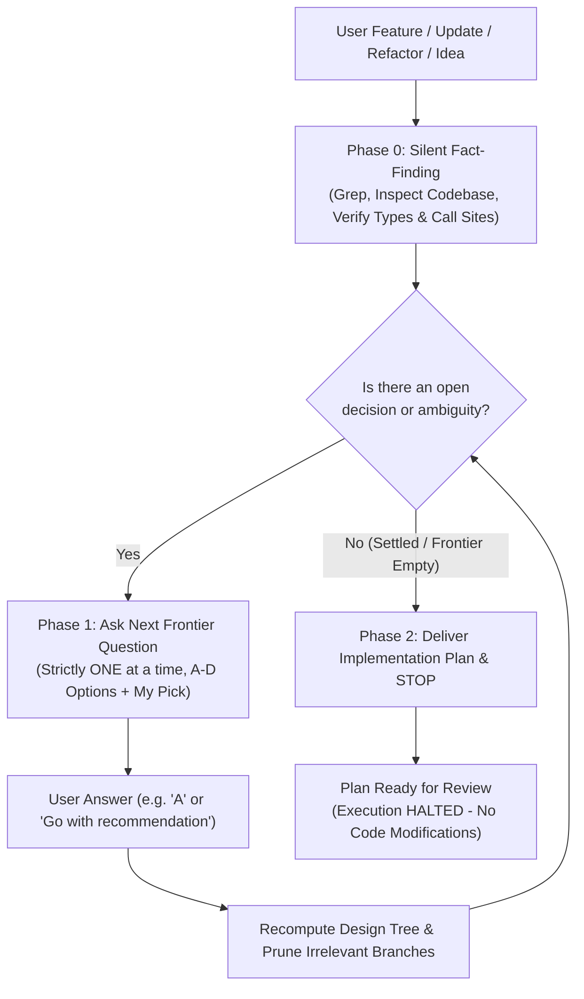

<!--
================================================================================
SKILL SYNTHESIS & DERIVATION METADATA
================================================================================
This skill (`clarify-first-delizade`) is a unified synthesis and architectural evolution
of two foundational skills:

1. `grilling` (Antigravity Core / Gemini):
   - Autonomous Fact-Finding: AI autonomously inspects the codebase/environment rather than burdening the user with factual questions.
   - Dynamic Decision Tree (Frontier): Models architectural problems as a dependency graph where resolved decisions unlock downstream branches and prune irrelevant ones.
   - Anti-Assumption Rigor: Prevents proceeding on silent assumptions.

2. `ask-then-build` (by David Ondrej):
   - Sequential Low-Cognitive-Load Interaction: Questions are asked strictly ONE AT A TIME with structured A-D options and an explicit agent recommendation ("My pick").
   - Early Termination & Scope Control: Avoids over-questioning; terminates as soon as the core path is clear.
   - Plan Synthesis: Compiles settled decisions into a concise, concrete implementation plan.

3. Delizade Directive (Strict Plan-Only Invariant):
   - Scope is strictly limited to clarification and implementation planning.
   - The agent MUST NOT start implementation, code generation, file modification, or build tasks. It stops immediately upon delivering the plan.
================================================================================
-->

Turn feature ideas, component/system updates, architectural decisions, or refactoring requests into execution-ready build specifications through autonomous codebase exploration, sequential single-question alignment, and concise plan compilation.

---

## Workflow Overview

---

## Phase 0 — Silent Fact-Finding (Fact vs. Decision Boundary)

1. **Facts belong to the AI, never the user.** Before asking anything, autonomously inspect the repository using available search and read tools:
   - Identify affected files, call sites, exports, interfaces, domain services, database schemas, and existing UI components.
   - Trace existing behaviors, edge cases, regression risks, architectural rules, and design system tokens.
2. **Never ask the user for facts you can look up yourself.** If a file path, function signature, current implementation, or configuration can be grepped, find it silently.
3. Formulate questions **only** for genuine business, architectural, UI/UX, or behavioral decisions where multiple valid tradeoffs or update strategies exist.

---

## Phase 1 — Sequential Dynamic Alignment (One Question at a Time)

1. Map open decisions as a **dynamic decision tree**. Identify the single most pivotal root decision currently on the **frontier** (decisions whose prerequisites are already settled).
2. Ask strictly **ONE question at a time**. Never bundle multiple questions together, as downstream questions often become obsolete based on the first answer.
3. **Mandatory Spacing, Formatting & Visual Separation Directives (STRICT)**:
   <formatting_directive priority="critical">
   - **Horizontal Rule After Question**: ALWAYS insert a horizontal rule (`---`) immediately after the question title and context, before listing options.
   - **Mandatory Blank Line After EVERY Option**: ALWAYS insert an empty blank line after each option (after A, after B, after C, after D). Never compress options into a contiguous paragraph.
   - **Horizontal Rule Before/After Recommendation**: Insert a horizontal rule (`---`) separating the options from the recommendation, and another horizontal rule (`---`) after the recommendation/question block.
   - **Zero Wall-of-Text**: Options must never be glued together. Each option must stand out as a distinct, comfortably spaced block.
   </formatting_directive>

4. Follow this exact structured layout template:

   ### ❓ <Question Title>?

   <One or two lines of essential context or tradeoff summary, if strictly necessary.>

   ---

   A. <First option: concise description + impact>

   B. <Second option: concise description + impact>

   C. <Third option: concise description + impact>

   D. <Fourth option: concise description + impact (or alternative)>

   ---

   **Benim önerim:** <Option Letter>. <One-line crisp rationale grounded in codebase architecture.>

   ---

5. Stop and wait for the user's response.
6. **Dynamic Tree Recomputation & Early Exit:**
   - When the user answers (e.g., `"A"`, `"Proceed with recommendation"`, or custom input), immediately update the decision tree.
   - Prune all branches made irrelevant by this answer.
   - If all necessary architectural, behavioral, and functional ambiguities are resolved, **terminate Phase 1 immediately** (typically 1 to 3 questions maximum). Do not ask artificial filler questions.

---

## Phase 2 — Implementation Plan Synthesis (Plan-Only / Zero Auto-Execution)

Once the frontier is resolved and no ambiguities remain, output a single, dense, execution-ready **Implementation Plan**:

1. **Authoritative Context & Read-First Files:** Target files, schemas, and governing rules (`AGENTS.md`, design tokens, service contracts).
2. **Concrete Implementation Steps:** Numbered, file-level changes detailing exact modifications without speculative fluff.
3. **Validation & Verification:** Automated tests, typecheck commands, lint checks, or manual visual validation criteria.
4. **Execution Boundaries:** Strict scope boundaries (e.g., zero regression on existing interfaces, adhere to design system, no unused dependencies).

### 🛑 CRITICAL INVARIANT: DO NOT START IMPLEMENTATION
This skill is strictly a **clarification and planning** skill. Under NO circumstances should the agent begin writing code, modifying files, executing migrations, or running build commands:
- Deliver the implementation plan clearly in markdown.
- Explicitly notify the user: *"Uygulama planı hazırlandı. Planı inceleyip onayladığınızda veya başlamak istediğinizde uygulamaya geçebiliriz."*
- **HALT EXECUTION IMMEDIATELY.** Do not call file modification or execution tools.

